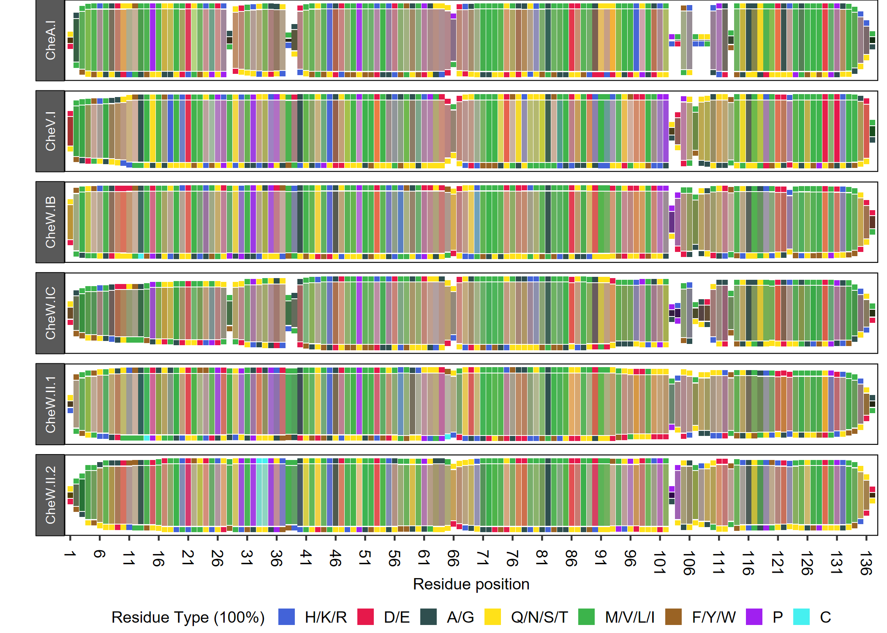
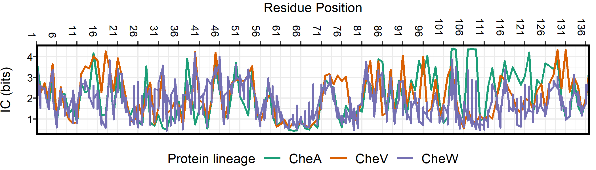
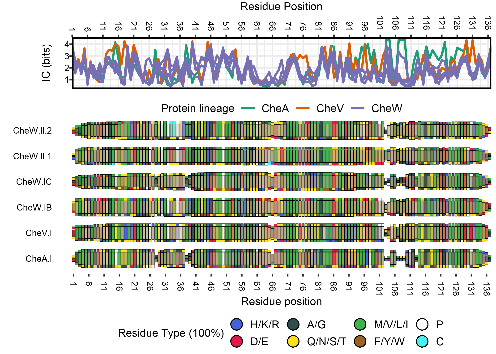
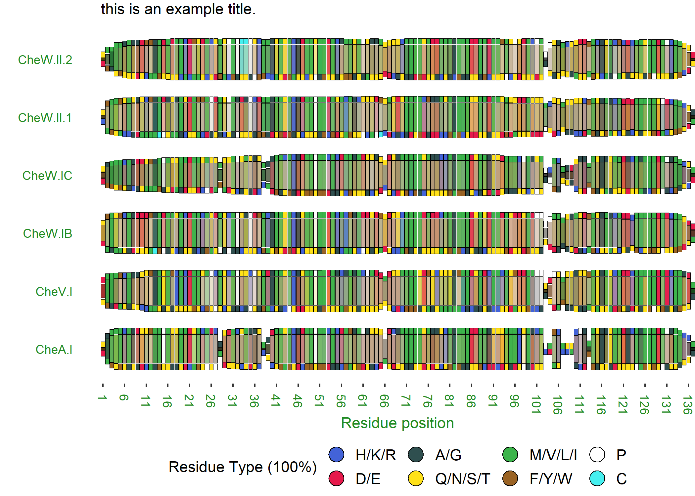
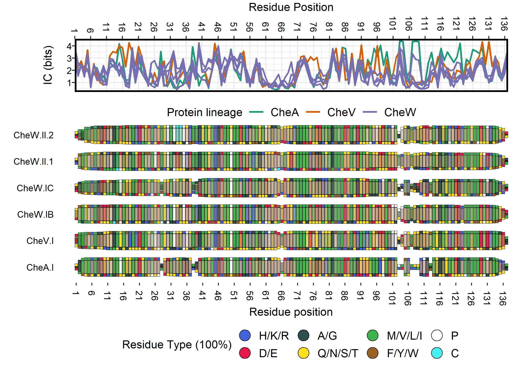
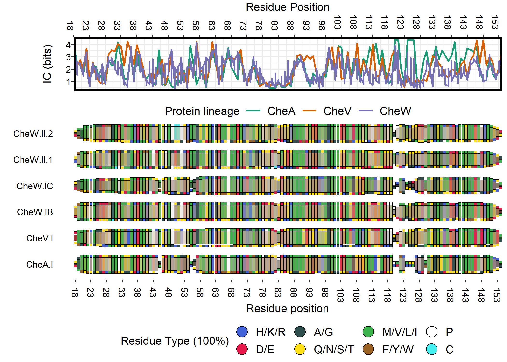
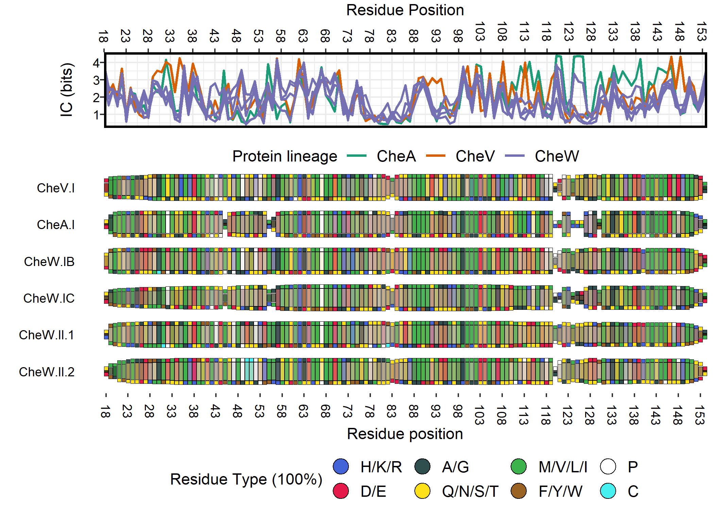

SimpLogo
================

<!-- README.md is generated from README.Rmd. Please edit that file -->

<!-- badges: start -->

<!-- badges: end -->

## Overview

The goal of SimpLogo is to develop a simplified, easy-to-read
visualization for a large group of multiple amino acid sequence
alignments that allows for convenient, simultaneous intergroup
comparisons with minimized graphical clutter.

## Installation

You can install the released version of SimpLogo from Github using the
devtools package:

``` r
library(devtools)
install_github("clayfos/SimpLogo",build_vignettes = TRUE)
```

## Example

SimpLogo utilizes the ggplot2 system to convert sequence alignments (in
FASTA format) into pseudo-1D, color-coded rows. Because of this, all of
the customization options offered by ggplot2 can be used to modify the
resulting SimpLogo plot. Here is a basic example of analyzing a
directory of FASTA alignments together.

### Input data

``` r
library(SimpLogo)

## use available files (.fa) in the sample_alignments directory
## we're only using 5 alignments for this example, but the 23 different CheW-containing architectures referenced in the publication can be found in the chew_alignments directory

## check filenames
seq.files <- list.files(path="sample_alignments/", 
                        all.files=TRUE, 
                        full.names=TRUE, 
                        include.dirs = FALSE,
                        pattern = "*fa")
seq.files
#> [1] "sample_alignments/CheA.I.separated.hmm.aligned.chew.as.ref.fa"   
#> [2] "sample_alignments/CheV.I.separated.hmm.aligned.chew.as.ref.fa"   
#> [3] "sample_alignments/CheW.IB.separated.hmm.aligned.chew.as.ref.fa"  
#> [4] "sample_alignments/CheW.IC.separated.hmm.aligned.chew.as.ref.fa"  
#> [5] "sample_alignments/CheW.II.1.separated.hmm.aligned.chew.as.ref.fa"
#> [6] "sample_alignments/CheW.II.2.separated.hmm.aligned.chew.as.ref.fa"

## you can manually specify alignment group names (for plotting)
## default takes them from the filenames
## make sure you order them correctly (check the filenames, like above)
groups <- c("CheA.I", "CheV.I", "CheW.IB", "CheW.IC", "CheW.II.1", "CheW.II.2")

## manually specify lineages (for grouping during plotting)
## must have 1 lineage assignment for every seq group being analyzed
lineage.assignments <- c("CheA","CheV","CheW","CheW","CheW","CheW")

results <- SimpLogo("sample_alignments/",
                    group.names = groups,
                    lineage.names = lineage.assignments)
```

The **results** object is a long-format dataframe containing the
converted frequencies and blended colors in hexadecimal. This can be
used as input for SimpLogoPlot().

``` r
head(results)
#>     color position     gap.freq info.content top.type secondary.type top.color
#> 1 #4e330b        1 0.9153339605   3.88936294  Q/N/S/T            D/E   #ffe119
#> 2 #366043        2 0.3066792098   2.48521344      A/G        M/V/L/I   #2F4F4F
#> 3 #5faf57        3 0.0799623706   2.57306601  M/V/L/I          F/Y/W   #3cb44b
#> 4 #7cb94d        4 0.0159924741   1.59894947  M/V/L/I        Q/N/S/T   #3cb44b
#> 5 #55b551        5 0.0047036689   3.06825575  M/V/L/I          F/Y/W   #3cb44b
#> 6 #a2908d        6 0.0037629351   0.89504853    H/K/R        Q/N/S/T   #4363d8
#>   secondary.color   arch lineage residue
#> 1         #e6194b CheA.I    CheA       1
#> 2         #3cb44b CheA.I    CheA       2
#> 3         #9a6324 CheA.I    CheA       3
#> 4         #ffe119 CheA.I    CheA       4
#> 5         #9a6324 CheA.I    CheA       5
#> 6         #ffe119 CheA.I    CheA       6

## here, the group names defined above are stored in the "arch" column
```

### Plotting SimpLogo

SimpLogoPlot() uses ggplot2 to generate the plot objects (with
geom\_tiles).

``` r
library(ggplot2)
library(Cairo)

plot <- SimpLogoPlot(results, plot.ic = TRUE)
#> Scale for 'y' is already present. Adding another scale for 'y', which will
#> replace the existing scale.
```

It produces a list of 3 graphical results, the primary SimpLogo plot
(the thing with the colored boxes) as a ggplot2 object, shown here:



A line graph of position-wise information content (in bits) as a ggplot2
object, shown here:



And a final combined plot (for convenience) created using the
plot\_grid() function of cowplot, shown here:



### Manually editing individual graphs

You can edit the individual plots as ggplot2 objects by modifying the.
Here we add a new overall title to our plot and change our axis text to
green using theme \[notice how we used the primary.plot object, the
final.plot can’t be edited due to the use of plot\_grid()\].

``` r
## now plot
plot$primary.plot + 
  labs(subtitle="this is an example title.") + 
  theme(axis.title.x.bottom =element_text(color="forestgreen"), 
        axis.text.x.bottom = element_text(color="forestgreen"), 
        axis.text.y.left = element_text(color="forestgreen"),
        plot.margin = margin(t=2)) ## to accomodate new title
```



### Recombining plots

If you decide to edit the ggplot2 objects, you can match the
plot\_grid() call in SimpLogoPlot() using the following:

``` r
final.plot <- cowplot::plot_grid(plot$ic.plot, plot$primary.plot,
                                 ncol = 1, align = 'v',
                                 axis = "lr", rel_heights = c(0.5, 1))
final.plot
```



### Renumbering alignment positions

If you’d like to easily renumber your alignment, starting at position 18
for example, you can use the following option when calling
SimpLogoPlot() \[or just modify it yourself by manipulating the ggplot2
object\]

``` r
plot2 <- SimpLogoPlot(results, plot.ic = TRUE, position.start = 18)
#> Scale for 'y' is already present. Adding another scale for 'y', which will
#> replace the existing scale.
plot2$final.plot
```



### Reordering sequence groups/architectures

You might want to reorder your architecture/sequence alignment groups.
You can set the factor levels in the original results object to manually
specify the order to ggplot2.

``` r
results2 <- results
results2$arch <- factor(results2$arch, levels = c("CheV.I","CheA.I","CheW.IB","CheW.IC","CheW.II.1","CheW.II.2"), ordered = TRUE) ## put CheV first, then CheA, then CheW
plot3 <- SimpLogoPlot(results2, plot.ic = TRUE, position.start = 18)
#> Scale for 'y' is already present. Adding another scale for 'y', which will
#> replace the existing scale.
plot3$final.plot
```



## To do list

More customization options. Possibly custom color palette options. Add
more complex instances in example section, including highlighting
specific positions, etc.
